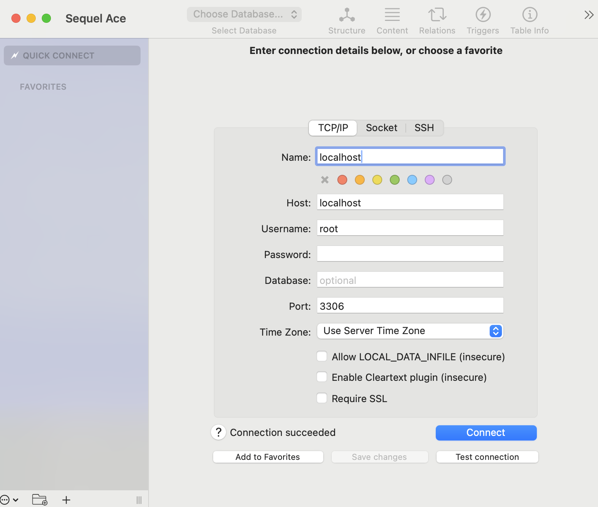

# Prerequisites
- Java JDK 17 or later
- Gradle 8.x or later
- Spring Boot 3.2.0 or latest stable
- Docker 27.x or later
- Liquibase 4.20.0 or later

# Setting Up a Database with Docker
```bash
# specific to macOS (needs to open the Docker app first)
open -a docker

# Run services described in the compose.yml in background
docker compose up -d 
```

# Running the Application
```bash
# Build the project
./gradlew build

# Run the application
./gradlew bootRun

```

# Database
- For testing purposes u can use SequelAce app for connecting with the database (or other)
<div align="center">
    
</div>

# Request Examples
- Request (Exchange Rate):
```
http://localhost:8080/api/rate?from=USD&to=BGN
```

```
{
  "success": true,
  "timestamp": 1748523853,
  "from": "USD",
  "to": "BGN",
  "rate": 1.731705
}
```
- Request (Amount Exchange):
```
http://localhost:8080/api/exchange?amount=150.55&from=BGN&to=USD
```

```
{
  "success": true,
  "timestamp": 1748524672,
  "from": "BGN",
  "to": "USD",
  "amount": 150.55,
  "result": 86.94
}
```
- Request (History Amount Exchange):
```
http://localhost:8080/api/history?minAmount=1000&maxAmount=6000&source=BGN&sort=amount,desc&page=0&size=1
```
```
{
  "content": [
    {
      "id": 8,
      "timestamp": "2025-05-27T23:32:13Z",
      "source": "BGN",
      "target": "USD",
      "amount": 5000,
      "result": 2898.39
    }
  ],
  "metadata": {
    "page": 0,
    "size": 1,
    "totalElements": 2,
    "totalPages": 2,
    "last": false
  }
}
```
Here u can use the pre-populated data in the "conversions" (history) table, 
which can be found in conversions_data.csv file in db.changelog in resources:

| Amount   | Result      | Source | Target | Timestamp            |
|----------|-------------|--------|--------|----------------------|
| 100.00   | 195.43      | EUR    | BGN    | 2025-05-27 23:28:18   |
| 200.00   | 238.41      | GBP    | EUR    | 2025-05-27 23:28:36   |
| 300.00   | 698.89      | GBP    | BGN    | 2025-05-27 23:28:47   |
| 255.00   | 1188471.80  | EUR    | COP    | 2025-05-27 23:29:18   |
| 170.00   | 126.93      | BGN    | BND    | 2025-05-27 23:29:58   |
| 1220.00  | 7.92        | ETB    | EUR    | 2025-05-27 23:30:22   |
| 640.00   | 864.28      | GBP    | USD    | 2025-05-27 23:30:50   |
| 5000.00  | 2898.39     | BGN    | USD    | 2025-05-27 23:32:13   |
| 40000.00 | 23187.12    | BGN    | USD    | 2025-05-27 23:32:36   |
| 13000.00 | 11475.16    | USD    | EUR    | 2025-05-27 23:32:57   |
| 100.00   | 47.97       | BGN    | CHF    | 2025-05-27 23:36:26   |
| 540.00   | 576.04      | CHF    | EUR    | 2025-05-27 23:36:39   |
| 1240.00  | 1109.66     | CHF    | GBP    | 2025-05-27 23:36:52   |
| 942.50   | 1625.90     | USD    | BGN    | 2025-05-27 23:37:38   |
| 1929.59  | 987.34      | BGN    | EUR    | 2025-05-27 23:37:55   |
| 3390.00  | 36969.87    | EUR    | SEK    | 2025-05-27 23:41:56   |
| 390.00   | 1.16        | XOF    | BGN    | 2025-05-27 23:42:15   |
| 580.00   | 7.57        | DZD    | BGN    | 2025-05-27 23:42:32   |
| 1580.00  | 16.13       | ALL    | EUR    | 2025-05-27 23:42:43   |
| 15.50    | 121.33      | EUR    | BOB    | 2025-05-27 23:42:58   |

- Swagger (for more detailed docs)
```
http://localhost:8080/swagger-ui/index.html
```


# Project Structure

```
├── gradlew.bat
├── settings.gradle
├── compose.yml
├── auto-generated-changelog.mysql.xml
src
├── test
│   ├── resources
│   │   └── application-test.yml
│   └── java
│       └── com
│           └── zetta
│               └── forex
│                   ├── util
│                   │   ├── TestConstants.java
│                   │   └── CurrencyMapCreator.java
│                   ├── ZettaForExApplicationTests.java
│                   └── service
│                       ├── ForexControllerIntegrationTest.java
│                       └── ForexApiServiceUnitTest.java
└── main
    ├── resources
    │   ├── log4j2.xml
    │   ├── db
    │   │   └── changelog
    │   │       ├── db.changelog-master.xml
    │   │       ├── changelog-v2.0.xml
    │   │       ├── data
    │   │       │   └── conversions_data.csv
    │   │       └── changelog-v1.0.xml
    │   └── application.yml
    └── java
        └── com
            └── zetta 
                └── forex
                    ├── ZettaForExApplication.java
                    ├── config
                    │   ├── LocalDateTimeProvider.java
                    │   ├── MapStructMapper.java
                    │   ├── RestConsumerConfig.java
                    │   ├── GlobalExceptionHandler.java
                    │   └── DataBaseInitializer.java
                    ├── aop
                    │   ├── ConversionHistoryMarker.java
                    │   └── ConversionHistoryAspect.java
                    ├── specification
                    │   └── ConversionHistorySpecification.java
                    ├── model
                    │   ├── dto
                    │   │   ├── ConversionHistoryResponse.java
                    │   │   ├── ConversionResponseDto.java
                    │   │   ├── AllRatesResponseDto.java
                    │   │   ├── ExchangeRateResponseDto.java
                    │   │   └── ErrorResponse.java
                    │   ├── entity
                    │   │   ├── ExchangeRatesEntity.java
                    │   │   ├── BaseEntity.java
                    │   │   └── ConversionHistoryEntity.java
                    │   ├── criteria
                    │   │   └── ConversionHistoryCriteria.java
                    │   └── validation
                    │       ├── ValidCurrencyAmount.java
                    │       ├── ValidCurrencyCode.java
                    │       ├── CurrencyCodeValidator.java
                    │       └── CurrencyAmountValidator.java
                    ├── util
                    │   └── Util.java
                    ├── service
                    │   ├── ConversionHistoryService.java
                    │   └── ForexApiService.java
                    ├── repo
                    │   ├── ConversionHistoryRepository.java
                    │   └── ExchangeRateRepository.java
                    └── rest
                        ├── ForexController.java
                        └── ConversionHistoryController.java
```
